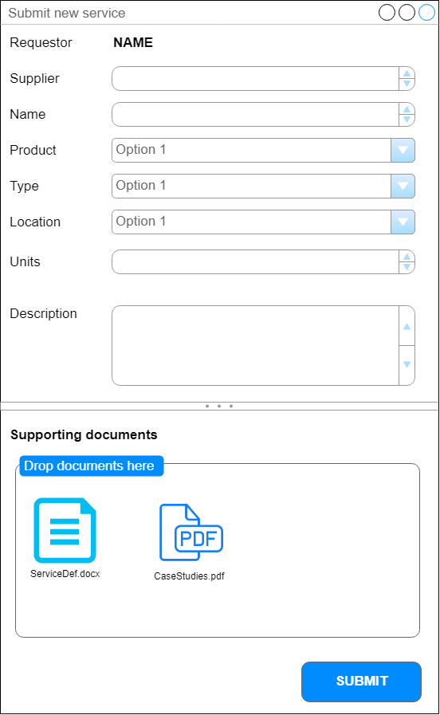
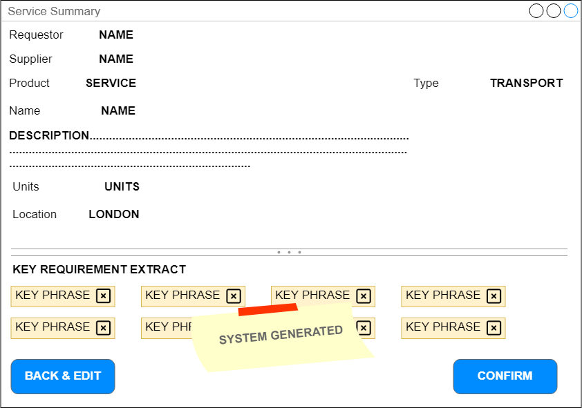
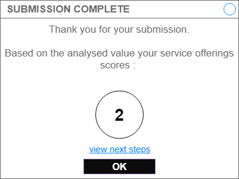
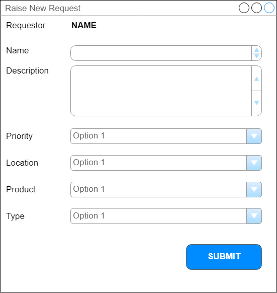
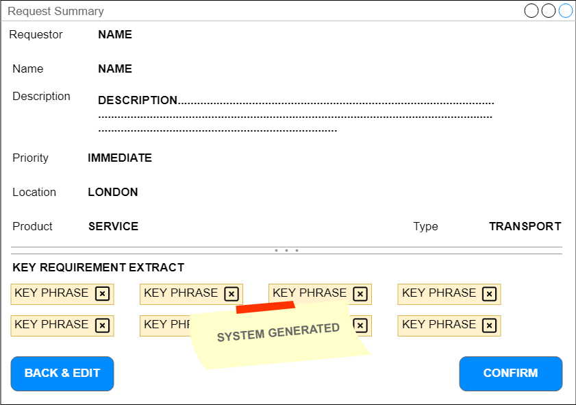

# COVID19 Intelligent Catalog Service

## Suppliers

Manual form based submission, solution would also support email.  
_(the email could also be forwarded from a government department to create the catalog entry)_ 

 

The system will then review and extract the key themes from the supplier, users can **go back and edit**, **remove suggestions** and **Submit** 
 
 

After submission the supplier is shown their calculated value and provided with a link to the relevant next steps. 
 

## Requests

 

The system will then review and extract the key themes from the request, users can **go back and edit**, **remove suggestions** and **Submit** 

 

