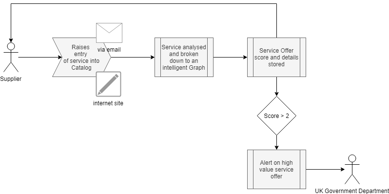
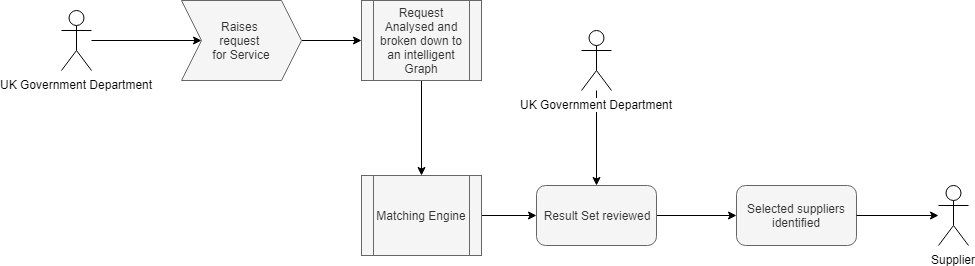
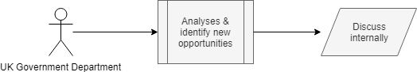

# covid19 Catalog Services
Automate the assessment of service offers from suppliers to identify the correct response from the UK Government.

The response could vary from `Inform the cabinet` to `advise the supplier to work with their local NHS response team`

## Problem Statement
> Suppliers and individuals are offering their services in support of the COVID19 pandemic; the sheer volume of offers is almost impossible to manage for a single government department or entry point.   The high volume is impacting the means to identify where an offer meets a current urgent need, highlights a potential new area of support or is a potential distraction; thus resulting in the risk to miss a key offer in this time critical response.

## The challenge
How to bring business intelligence to help identity the right suppliers for the 1000's of requests being raised by various UK government departments.

## Personas

### Government department
Government department with a clear requirement to help support the COVID19 response

### Suppliers
General suppliers of any potential services to the government.

### Scoring

1. Immediate value
2. Near term value 
3. Mid term value 
4. Long term value
5. Local community value

## Use Cases

### Use Case 1
Supplier raises a service offer 
 

### Use Case 2
Government department raises a service request 
 

### Use Case 3
Government department analyse service offers to identify new potential responses 
 

## Assumptions
UK government requirements are clearly defined, however each department should have the means to analyse all service offers to identify new areas of opportunity.

---

- [Architecture](architecture.md)
- [SiteMap](siteMap.md)
- [Datamodel](dataModel.md)
- [Manual Capture forms](CaptureForms.md)
- [Matching Logic](Matching.md)
- [Required Skills](Skills.md)

---

## References

- [UK catalogue of suppliers](https://www.crowncommercial.gov.uk/covid-19/covid-19-buyer-information/catalogue-of-supplier-offers/)